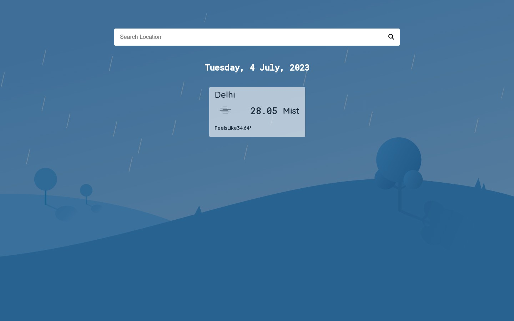

# Weather Application - Vanilla JS

This is a simple weather application that fetches weather information from the OpenWeatherMap API and displays it on the screen.

## Features

- Fetches weather data from the OpenWeatherMap API
- Displays current weather information, including temperature, feels like temperature, and weather conditions
- Beautifully designed user interface using HTML and CSS

## Screenshots



## Usage

To use this weather application, follow these steps:

1. Clone the repository or download the source code.
2. Open the `index.html` file in a web browser.
3. Sign up for an API key at [OpenWeatherMap API](https://openweathermap.org/) (if you don't have one).
4. Replace the placeholder API key in the `script.js` file with your own API key.
5. Save the file and reload the application in the web browser.

## Technologies Used

- HTML
- CSS
- JavaScript
- OpenWeatherMap API

## API Key

To use the OpenWeatherMap API and fetch weather data, you need an API key. If you don't have one, you can sign up for a free API key at [OpenWeatherMap API](https://openweathermap.org/). Once you have the API key, replace the placeholder API key in the `script.js` file with your own API key.

```javascript
const apiKey = 'YOUR_API_KEY';
```

## Acknowledgments

This weather application was created as a learning project. It utilizes the OpenWeatherMap API to retrieve weather information and showcases a beautiful user interface. Feel free to modify and customize the code according to your needs.
